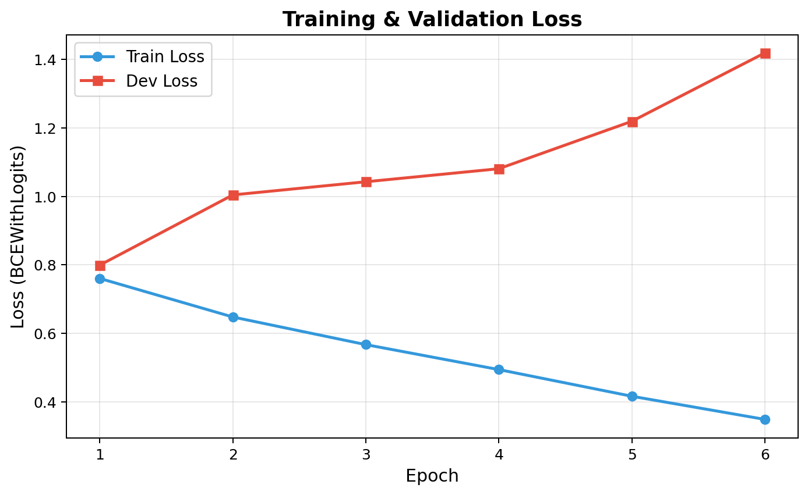
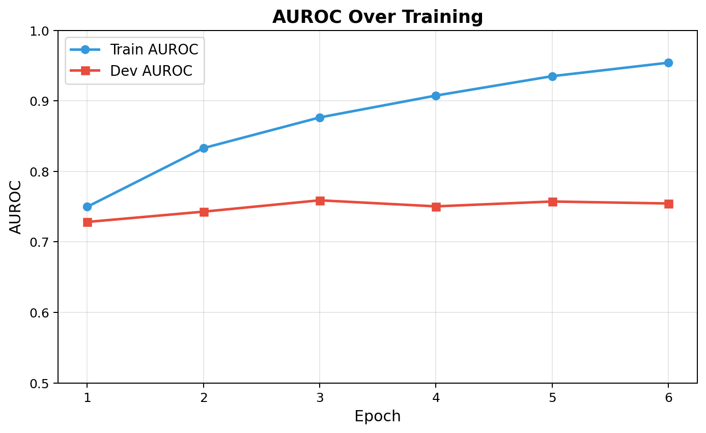
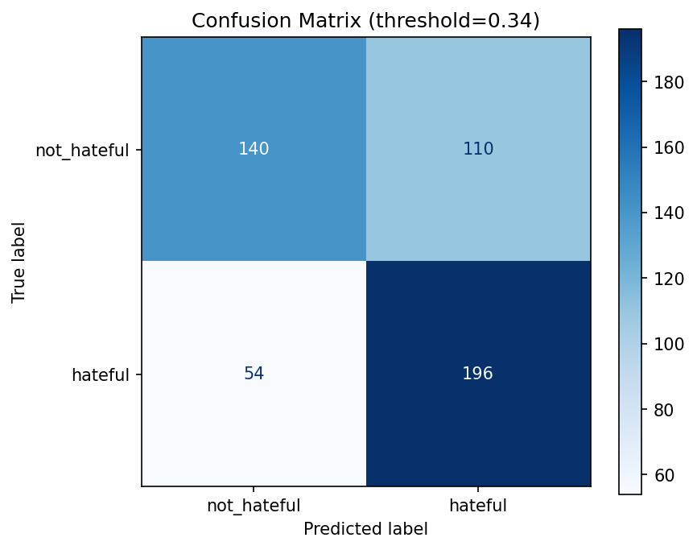

# Hateful Meme Classifier

A multimodal deep learning system for detecting hateful content in memes, combining visual and textual understanding through CLIP embeddings and cross-attention fusion.

## Project Overview

**Dataset:** [Facebook Hateful Memes Challenge](https://ai.facebook.com/tools/hatefulmemes/)
- 8,500 training / 500 dev / 1,000 test memes
- Binary classification: hateful (1) vs not hateful (0)
- Class imbalance: 64% not hateful, 36% hateful in training set

**Problem:** Memes are inherently multimodal — an image of a dog with the text "I love you" is benign, but the same image paired with hateful text becomes toxic. The model must understand the *combination* of image and text to detect hate, not just each modality alone.

## Architecture

### Final Model: 3-Branch CLIP + Cross-Attention Fusion

The architecture uses a frozen **CLIP ViT-L/14** backbone with a trainable cross-attention classification head:

```
                    ┌──────────────────┐
                    │  CLIP ViT-L/14   │ (frozen)
                    │  clip_dim = 768  │
                    └──────┬───────────┘
                           │
              ┌────────────┼────────────┐
              ▼            ▼            ▼
        ┌──────────┐ ┌──────────┐ ┌──────────────┐
        │  Image   │ │   Text   │ │   "hateful"  │
        │ Encoder  │ │ Encoder  │ │   Query Emb  │
        │ (768-d)  │ │ (768-d)  │ │   (768-d)    │
        └────┬─────┘ └────┬─────┘ └──────┬───────┘
             │            │              │
             ▼            ▼              ▼
        ┌──────────┐  ┌─────────┐   ┌──────────┐
        │ K/V proj │  │ K/V proj│   │  Q proj  │
        │ (256-d)  │  │ (256-d) │   │  (256-d) │
        └────┬─────┘  └────┬────┘   └────┬─────┘
             │             │             │
             └──────┬──────┘             │
                    ▼                    ▼
            ┌───────────────────────────────────┐
            │    Multi-Head Cross-Attention     │
            │  Q = hateful query                │
            │  K, V = [image_emb, text_emb]     │
            │  4 heads, 256-d                   │
            └───────────────┬───────────────────┘
                            ▼
                    ┌───────────────┐
                    │  LayerNorm    │
                    │  + MLP Head   │
                    │  256→128→1    │
                    └───────┬───────┘
                            ▼
                      P(hateful)
```

**Key design choices:**
- **Frozen CLIP encoders** — leverage pre-trained multimodal understanding
- **Learnable "hateful" query** — initialized from CLIP text embedding of "hateful", learns to attend to hateful features
- **Separate K/V projections** for image and text — allows the model to weight each modality differently
- **BCEWithLogitsLoss** with `pos_weight` to handle class imbalance

**Training details:**
- Optimizer: AdamW (lr=2e-4, weight_decay=0.01)
- Scheduler: Linear warmup (100 steps) + Cosine annealing
- Early stopping: patience=5 on dev AUROC
- Device: Apple M4 (MPS)

### Baseline Model: Logistic Regression on CLIP Features

For comparison, a simple Logistic Regression baseline was trained on concatenated CLIP image + text embeddings (1536-d feature vector). Run with:

```bash
python -m src.baseline
```

### Training Loss & AUROC Curves

<p align="center">
  
  
</p>

### Confusion Matrix (Dev Set)

<p align="center">
  
</p>

## Project Structure

```
hatefulmemes_v3/
├── config/
│   └── config.yaml              # All hyperparameters (single source of truth)
├── src/
│   ├── model.py                 # HatefulMemeClassifier (cross-attention head)
│   ├── train.py                 # Training loop with early stopping
│   ├── evaluate.py              # Evaluation, threshold tuning, confusion matrix
│   ├── predict.py               # Single-image inference pipeline
│   ├── dataset.py               # PyTorch Dataset for hateful memes
│   ├── ocr.py                   # OCR pipeline (JSONL lookup + docTR)
│   ├── baseline.py              # Logistic Regression baseline on CLIP features
│   ├── error_analysis.py        # Find and visualize misclassified memes
│   ├── eda.py                   # Exploratory Data Analysis (11 plots)
│   ├── test.py                  # Generate predictions for unlabelled test set
│   └── plot_training_curves.py  # Parse logs and plot loss/metric curves
├── app/
│   └── app.py                   # Gradio web interface
├── scripts/
│   ├── train.sh                 # Launch training
│   ├── eval.sh                  # Run evaluation
│   ├── run_app.sh               # Launch Gradio web app
│   └── run_full.sh              # Full production pipeline (zero to app)
├── data/                        # Dataset (not tracked in git)
│   ├── train.jsonl / dev.jsonl / test.jsonl
│   └── img/                     # 10,000 meme images
├── checkpoints/                 # Saved model weights (not tracked in git)
├── outputs/                     # EDA plots, training curves, predictions
├── logs/                        # Training logs, confusion matrices
├── requirements.txt
├── .gitignore
└── README.md
```

## How to Run

### 0. Full Pipeline (from scratch)

```bash
bash scripts/run_full.sh
```

Runs everything: environment setup, training, evaluation, prediction, and launches the web app.


### 1. Setup

```bash
git clone <repo-url>
cd hatefulmemes_v3
pip install -r requirements.txt
```
https://www.kaggle.com/datasets/parthplc/facebook-hateful-meme-dataset/data
Place the Facebook Hateful Memes dataset in `data/`:
- `data/img/` — meme images (PNG)
- `data/train.jsonl`, `data/dev.jsonl`, `data/test.jsonl`


### 2. Exploratory Data Analysis

```bash
python -m src.eda
```

Generates 11 visualisation plots in `outputs/eda/`.


### 3. Train the Baseline

```bash
python -m src.baseline
```

Saves results and confusion matrix to `outputs/`.


### 4. Train the Final Model

```bash
bash scripts/train.sh
# Training takes ~15 min/epoch on Mac M4 (MPS)
```


### 5. Evaluate

```bash
bash scripts/eval.sh              # Evaluate on dev set
```


### 6. Error Analysis

```bash
python -m src.error_analysis
```

Generates failure visualizations in `outputs/error_analysis/`.


### 7. Generate Test Predictions

```bash
python -m src.test
```

Saves `outputs/test_predictions.csv` with predictions for the unlabelled test set.


### 8. Single Image Inference

```bash
python -m src.predict path/to/meme.png
```

Example output:
```
label: hateful
confidence: 0.873
hateful_probability: 0.873
extracted_text: when you see a muslim in the airport
```


### 9. Web App (Gradio)

```bash
bash scripts/run_app.sh
# Opens at http://localhost:7860
```

Upload any meme image to get a classification with confidence score and extracted text.


## OCR Pipeline

For text extraction from memes:
1. **JSONL lookup** — if the image matches a known dataset image, use the ground-truth text (instant)
2. **docTR** — morphological masking (isolates white text on dark backgrounds) + docTR OCR model
3. **Correction dictionary** — 700+ word post-processing dictionary for capitalisation and common OCR errors

## Tech Stack

- **PyTorch** — model training and inference
- **CLIP ViT-L/14** (OpenAI) — frozen multimodal encoder
- **docTR** — OCR text extraction
- **Gradio** — web interface
- **scikit-learn** — baseline model, evaluation metrics
- **Matplotlib** — visualisations
- **Device:** Apple M4 (MPS) / CPU
